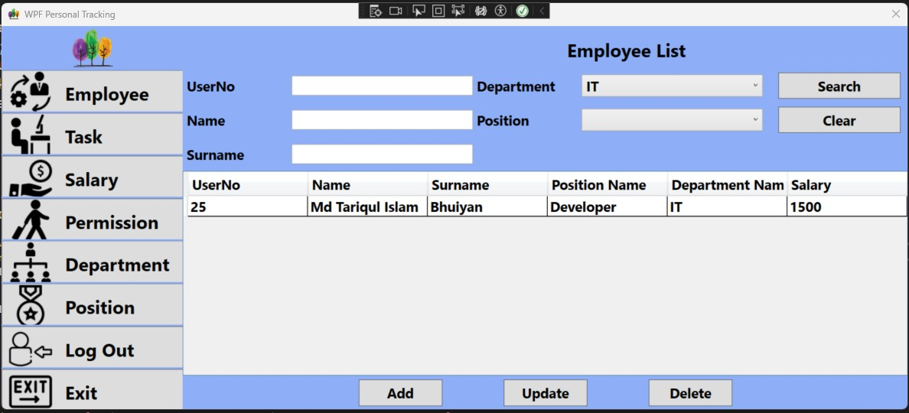
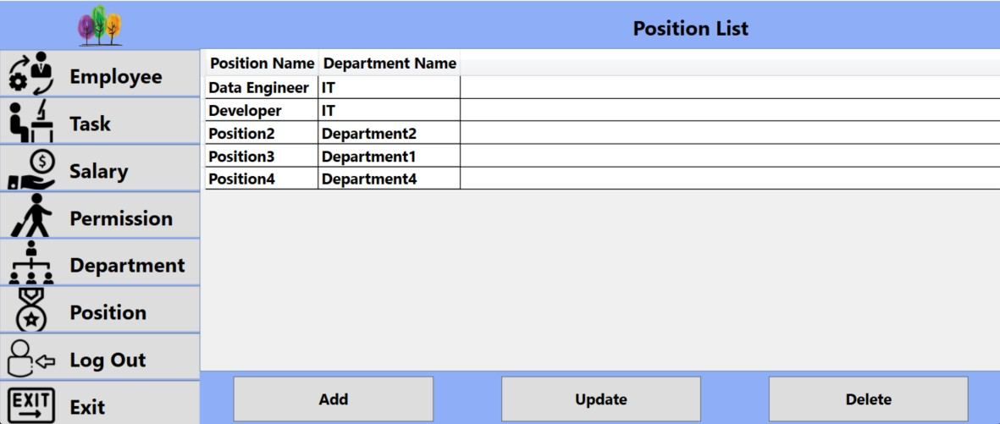
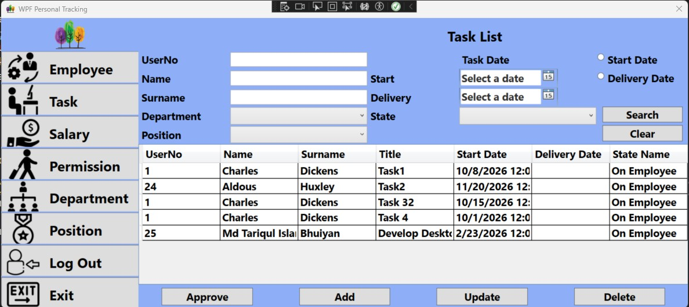

# WPF Personal Tracking (HR / Employee Management)

A desktop **WPF (.NET Core)** application for basic HR operations and employee tracking.  
It supports managing **Departments, Positions, Employees, Tasks, Permissions (Leave Requests), and Salaries** using **SQL Server** with **Entity Framework Core**.

---

## ✨ Features

### 🔐 Login + Roles
- Login with **UserNo + Password**
- **Admin** and **Employee** roles:
  - **Admin:** full access to management screens
  - **Employee:** limited access (can view own profile and own tasks, and can deliver tasks)

### 🏢 Department & Position Management (Admin)
- Create / update / delete **Departments**
- Create / update / delete **Positions** linked to departments

### 👤 Employee Management (Admin)
- Add / update / delete employees
- Search and filter by:
  - UserNo, name, surname
  - department, position
- Store employee details:
  - name, surname, birthday, address, salary, photo path
  - department & position
  - admin flag

### ✅ Task Tracking
- Admin creates tasks for employees
- Task lifecycle states:
  - **OnEmployee → Delivered → Approved**
- Employee can mark task as **Delivered**
- Admin can **Approve** delivered tasks
- Search/filter tasks by:
  - employee, department, position
  - task state
  - date range (start date / delivery date)

### 📝 Permissions (Leave Requests)
- Employee creates permission/leave requests
- Admin can approve/disapprove
- Tracks permission state and duration/amount

### 💰 Salary Records
- Salary entries per employee and month
- View, add, update, delete salary records

---

## 🧰 Tech Stack

- **WPF** (Desktop UI)
- **.NET Core 3.1** (`netcoreapp3.1`)
- **Entity Framework Core** (SQL Server provider)
- **Microsoft SQL Server** (LocalDB or SQL Server instance)

---

## 📁 Project Structure

- `DB/`  
  EF Core entities + `PersonalTrackingContext` (SQL Server DbContext)
- `Views/`  
  UI UserControls for lists (Department, Employee, Task, etc.)
- `ViewModels/`  
  DTO/detail models (used for grid/list projection)
- `*.xaml` pages  
  Windows & pages (Login, Main, CRUD pages)

> Note: Most CRUD logic is implemented in **UserControl code-behind** (e.g., `Views/*List.xaml.cs`) using EF Core queries.

---

## ✅ Requirements

- Visual Studio (recommended: 2019/2022 with Desktop Development workload)
- SQL Server or SQL Server Express / LocalDB
- .NET Core 3.1 SDK (or Visual Studio runtime support)

---

## 🗄️ Database Setup (SQL Server)

This repo includes a ready SQL script:

- `WPFPersonalTrackingScript.sql`

### Option A — Run the SQL Script (Recommended)
1. Open **SQL Server Management Studio (SSMS)**
2. Open `WPFPersonalTrackingScript.sql`
3. **Important:** the script may include a specific `.mdf/.ldf` file path.  
   Update it to match your machine OR remove the explicit file path so SQL Server uses defaults.
4. Execute the script (it creates the database + tables + sample data)

### Option B — Use your own SQL Server database
If you create your own DB, make sure the schema matches the EF models in `DB/`.

---

## 🔧 Connection String

The connection string is currently inside:

`DB/PersonalTrackingContext.cs`

```csharp
optionsBuilder.UseSqlServer("Server=.; Database=PersonalTracking; Trusted_Connection=True;");

## 📸 Screenshots / UI Icons




